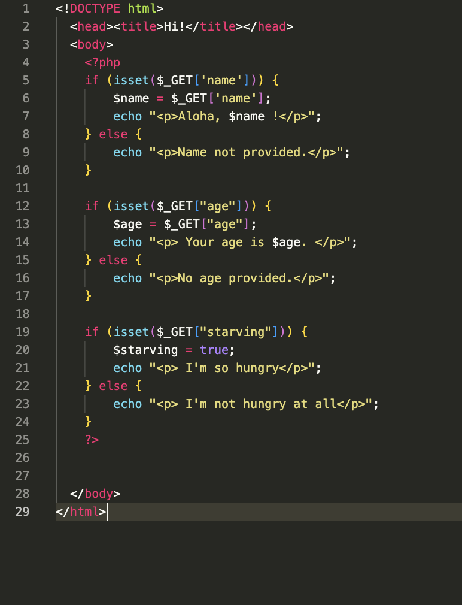

# PHP tryout

First page with the title and the image who links itself to the other one as a test.

The second one, checked 

There will be the list of exercises connecting to each of their own page 

So for now i'm working on only one port/environment

## Soo for exercise 1 : The variables here's what i did 

## $name $age $hungry

I tested, the value **$name, $age and the variables with a true or false** answer typed in the url 

The value needs to be writen in **the URL**

## $array 

I tried to translate the **index into letter**, it finally did work !

This is the output when the index is precised in the URL **&team=2**

else >

